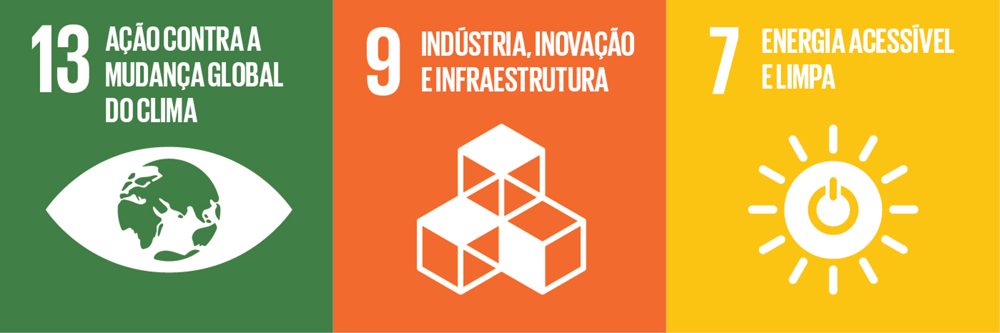
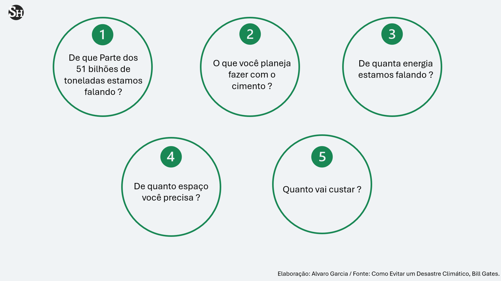

{width="295"}

# A Tecnologia como resposta

Por toda sua trajetória desde a criação da Microsoft Bill Gates sempre mostrou **sua fé na tecnologia para solução dos grandes problemas do mundo**. Essa visão fica clara nos livros e artigos que escreve mas também em sua série documental na Netflix. No entanto, neste livro, embora a tecnologia ainda seja o ponto de partida para o combate as mudanças climáticas, ele abre espaço para mostrar também os desafios associados aos **componentes sociais, culturais e políticos** na prevenção e mitigação do desastre climático.

Além das diferentes **soluções tecnológicas** que poderiam permitir a transição para uma **sociedade de baixo carbono**, abordando desde a geração de energia até o problema da produção de insumos essenciais, o autor apresenta uma forma muito interessante de abordar o tema. Um ótimo exemplo dessa abordagem, **são as perguntas essenciais a se fazer sempre** que se estuda ou avalia projetos e tecnologias inovadoras na **transição climática**.

## As peguntas essenciais ao se pensar nas soluções

{fig-align="center"}

**1. De que Parte dos 51 bilhões de toneladas estamos falando ?**

Colocar em perspectiva o total das emissões globais ao avaliar novas tecnologias ou projetos é essencial para atuar de forma efetiva contra as mudanças climáticas.

**2. O que você planeja fazer com o cimento ?**

Embora uso o cimento como grande exemplo, essa pergunta busca sempre avaliar como insumos essenciais no desenvolvimento moderno (Aço e Cimento por exemplo) que são intensivos na geração de carbono vão ser tratados dentro desse contexto.

**3. De quanta energia estamos falando ?**

Essa questão é essencial quando o assunto for transição energética. Colocar em perspectiva o potencial de novas fontes, usinas e tecnologias.

**4. De quanto espaço você precisa ?**

Algumas fontes de energia ocupam mais espaço que outras. A densidade de potência é uma medida muito útil na avaliação de tecnologias e projetos.

**5. Quanto vai custar ?**

O mundo produz tantas emissões até hoje por que a tecnologia de energia e produção atuais são de longe as mais baratas disponíveis.

Essas perguntas norteiam todos os temas tratados no livro, onde dados como os **prêmios verdes** de cada tecnologia e densidade de potência entre outros são apresentados e comparados com as soluções atuais. Isso torna a discussão e entendimento dos principais desafios, como também das soluções disponíveis, mais simples e transparente.

## Conclusão

O livro é uma ótima recomendação sobre o tema das mudanças climáticas e principalmente de como o planeta pode atuar para evitar os caminhos mais sombrios esperados. Além da prevenção, a adaptação e contexto das políticas públicas nesse desafio completam uma obra densa mas simples e com uma esperança na em evitar o pior que o aquecimento global pode causar.

[{width="519"}](https://amzn.to/4fgH2Pu)
